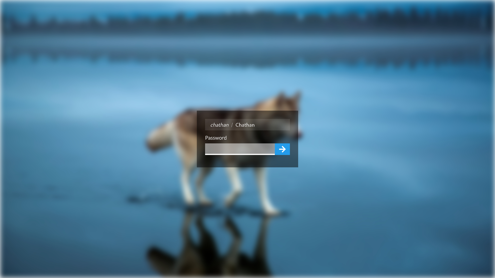
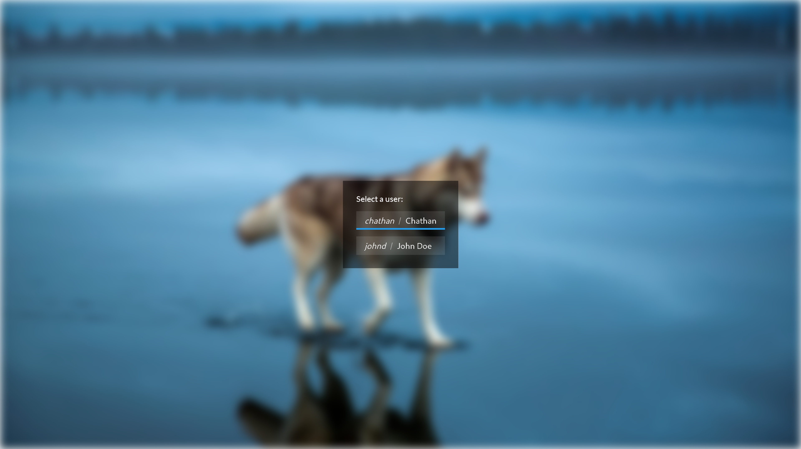

# lightdm-webkit-theme

My custom theme for lightdm-webkit2-greeter.





## Usage

### Prerequisites

Install `lightdm-webkit2-greeter` and edit `/etc/lightdm/lightdm.conf` to use it
by setting the `greeter-session` variable in the `Seat:*` section:

```conf
# /etc/lightdm/lightdm.conf

[Seat:*]
greeter-session=lightdm-webkit2-greeter
```

### Build

Use Yarn (preinstalled in the VSCode devcontainer) to build the theme:

```bash
yarn build
```

### Install

Use the [install script](./install.sh) to install the theme. It should be run
from the repository root and needs to be run as a user with permission to modify
files in `/usr/share/lightdm-webkit/themes`:

```bash
# Modify 'custom-theme' to whatever theme name you want.
./install.sh custom-theme
```

## Developing

Since `lightdm-webkit2-greeter` uses webkit, we can use any set of tooling we
want as long as it outputs standard HTML, CSS, and Javascript files. This theme
is written in Typescript as a React app using Webpack to bundle the app.

### Quickstart

Open the repository in VS Code using the "Remote Containers" extension. The
theme can be built and previewed locally at http://localhost:8080 by running:

```bash
yarn start
```

### LightDM API

Interactions with LightDM are done through some global utility objects that
`lightdm-webkit2-greeter` exposes on the `window` object. The best source for
documentation on these globals is the greeter's man page:

```bash
man lightdm-webkit2-greeter
```

This theme also contains the Typescript type definitions for those globals.

When running the theme in a browser, the LightDM utilities are mocked out so
that most testing can be done in the browser which gives a faster feedback
loop.

## License

This project is licensed under the [MIT License](./LICENSE).
